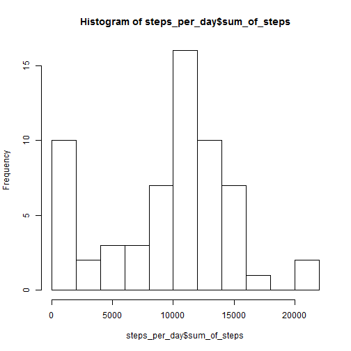
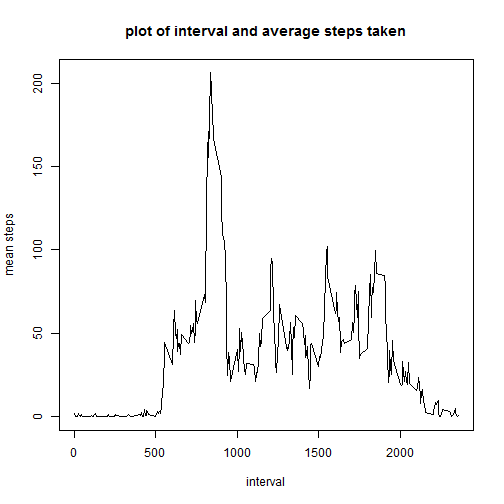
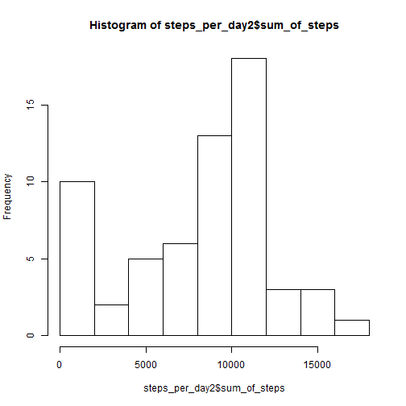
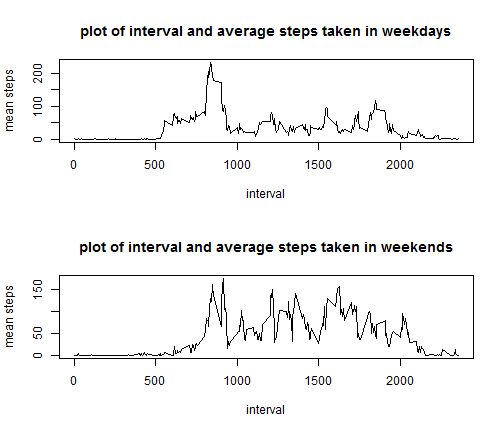

###Loading and preprocessing the data


```r
read.csv("activity.csv", as.is = 2)->data1
```
some summary of the datafile

```r
str(data1)
```

```
## 'data.frame':	17568 obs. of  3 variables:
##  $ steps   : int  NA NA NA NA NA NA NA NA NA NA ...
##  $ date    : chr  "2012-10-01" "2012-10-01" "2012-10-01" "2012-10-01" ...
##  $ interval: int  0 5 10 15 20 25 30 35 40 45 ...
```


###What is mean total number of steps taken per day?
prepare data

```r
steps_per_day<-aggregate(data1$steps, by = list(data1$date), 
          FUN = function(x) sum(x, na.rm = T))
colnames(steps_per_day)<-c("day", "sum_of_steps")
```

histogram of total number of steps per day:

```r
hist(steps_per_day$sum_of_steps, breaks = 10)
```

 

median and arithmetic mean are:

```r
summary(steps_per_day$sum_of_steps)[3:4]
```

```
## Median   Mean 
##  10400   9354
```

###What is the average daily activity pattern?
prepare data

```r
steps_per_interval<-aggregate(data1$steps, by = list(data1$interval), 
          FUN = function(x) mean(x, na.rm = T))
colnames(steps_per_interval)<-c("interval", "mean_of_steps")
```

histogram of total number of steps per day:

```r
plot(steps_per_interval$interval, steps_per_interval$mean_of_steps, type ="l",
main = "plot of interval and average steps taken",
xlab = "interval", ylab = "mean steps")
```

 

Which interval has maximum steps

```r
max1<-max(steps_per_interval$sum_of_steps)
```

```
## Warning in max(steps_per_interval$sum_of_steps): no non-missing arguments
## to max; returning -Inf
```

```r
w1<-which(steps_per_interval$sum_of_steps==max1)
interval_max<-steps_per_interval$interval[w1]
```

maximum is -&infin; and it happens at interval .

###Imputing missing values

computing uncomplete cases

```r
ok_case<-complete.cases(data1)
not_ok_case_n<-sum(!ok_case)
```
The number of uncoplete is 2304

Prepare the dataset with medians for each interval

```r
steps_median<-aggregate(data1$steps, by = list(data1$interval), 
          FUN = function(x) median (x, na.rm = T))
colnames(steps_median)<-c("interval", "median_of_steps")
```

merge medians to old data and repleace missings with it


```r
merge (data1, steps_median, by  = "interval", all.x = T)->data2
data2[!ok_case, "steps"]<-data2[!ok_case, "median_of_steps"]
data2<-data2[,1:3]
```

prepare data

```r
steps_per_day2<-aggregate(data2$steps, by = list(data2$date), 
          FUN = function(x) sum(x, na.rm = T))
colnames(steps_per_day2)<-c("day", "sum_of_steps")
```

histogram of total number of steps per day:

```r
hist(steps_per_day2$sum_of_steps, breaks = 10)
```

 

median and arithmetic mean are:

```r
summary(steps_per_day2$sum_of_steps)[3:4]
```

```
## Median   Mean 
##   9727   8077
```

the differences between raw and imputed data summaries is:


```r
summary(steps_per_day$sum_of_steps)[3:4] - 
      summary(steps_per_day2$sum_of_steps)[3:4]
```

```
## Median   Mean 
##    673   1277
```
so both mean and median are lower after median substitution

###Are there differences in activity patterns between weekdays and weekends?

first prepare data, we will set locale to us to have english weekday names,
I hope it will work on non Windows machines.

```r
Sys.setlocale("LC_TIME", "US")
```

```
## [1] "English_United States.1252"
```

```r
data1$weekday<-weekdays(as.Date(data1[,2]))
weekend_days<-c("Saturday", "Sunday")
data1$weekday[data1$weekday %in% weekend_days]<-"weekend"
data1$weekday[data1$weekday!= "weekend"]<-"weekday"
data1$weekday<-as.factor(data1$weekday)
```

let's prepare aggregate data for ploting

```r
steps_per_interval_weekday<-aggregate(data1$steps, by = list(data1$weekday, data1$interval), 
          FUN = function(x) mean(x, na.rm = T))
colnames(steps_per_interval_weekday)<-c("weekday", "interval", "mean_of_steps")
```


plot steps timeseries for weekdays and weekends


```r
par(mfrow=c(2,1))
plot(steps_per_interval_weekday$interval[steps_per_interval_weekday$weekday=="weekday"], 
     steps_per_interval_weekday$mean_of_steps[steps_per_interval_weekday$weekday=="weekday"], type ="l",
main = "plot of interval and average steps taken in weekdays",
xlab = "interval", ylab = "mean steps")

plot(steps_per_interval_weekday$interval[steps_per_interval_weekday$weekday!="weekday"], 
     steps_per_interval_weekday$mean_of_steps[steps_per_interval_weekday$weekday!="weekday"], type ="l",
main = "plot of interval and average steps taken in weekends",
xlab = "interval", ylab = "mean steps")
```

 
